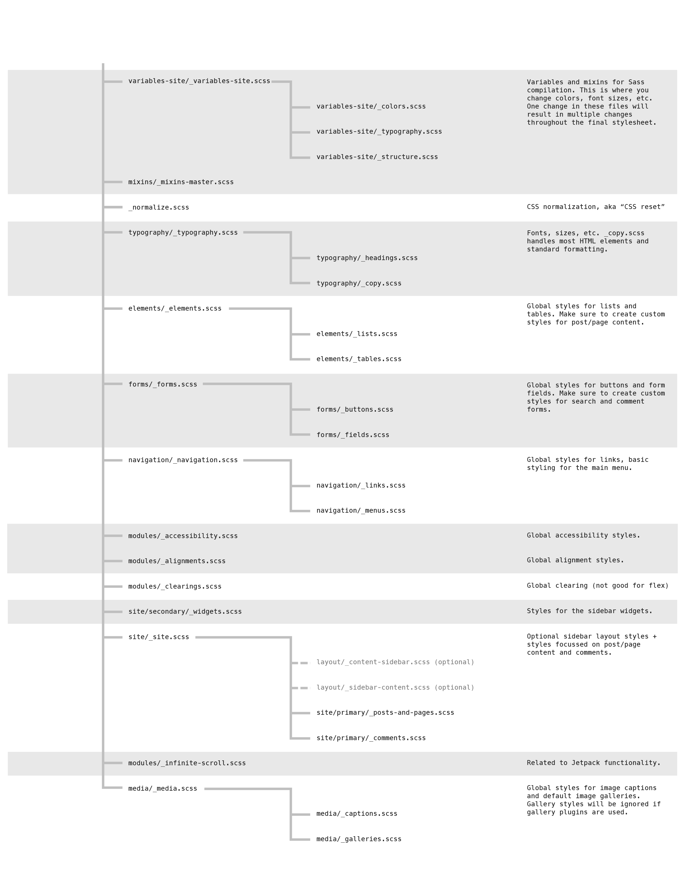

# Using Sass partials in underscores

In WordPress themes, the main style sheet is, style.css, which sits in the root of the Theme folder. Technically if you want to change the appearance of your theme, you would do it in this file, style.css. However, we're using Sass to generate our css and we're using Gulp to auto-generate this file, style.css.

So we won't be working in style.css, instead we're going to work in the sass folder, and all the partials. Underscores has an extremely fragmented setup for Sass partials. So we need to know how this all fits together.

Lets open the the style.scsss file. 

The two headers \(style.css and style.scss\) match exactly and if we scroll down, we have the Table of Contents and then in place of the actual styles, we have a series of these, @import that points at a folder and then a file name or just a file name. What'll happen here is when Gulp runs the Sass function on this file, it'll say, here's a file, let's import the contents from that file. File sits in the variables-site folder and is called variable-site. 

The content is actually in a different file, so we'd need to import that content from the file, say for instance colors. We would go to \_colors.scss and we have variables. Then the same for typography, etc. 

