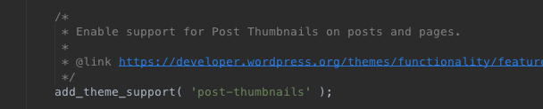

# Featured Images

The featured image, or post thumbnail,  is an important tool in WordPress themes. The featured image is typically displayed above post titles on index pages and is also an image social media services use when your content is shared. In the post editor, you add a featured image separately from your regular content and you can add only one featured image per post. Where and how that featured image appears, is entirely up to the theme designer and developer.

The size and crop value for featured images is controlled by you, the theme designer and developer, meaning this is the one image you can apply art direction to. You can also define multiple, different sizes for featured images to be displayed at different locations within a theme, as an example, you can define an index image size of 500 x 400 that will be called an on index pages and in a larger version, called single image, with a size of 2000 x 800 that will be displayed in single posts.

When an author adds a featured image, WordPress will grab the custom featured image sizes,and crop and size new versions of the uploaded image to fit. The reason why all functions related to featured images refer to them as post thumbnails, is because they used to be used for specifically that purpose. As post thumbnails. They were originally used to displaying a small image on index pages next to the post title and excerpt and then when you clicked on that image, you'd be taken to the full article. Today we use featured images for a lot more than that.

The function for the feature image is located in your functions.php file:



So the functionality is there, but how do we get the feature image to show in our single post. We need to open up our content.php and add the following code:

```php
<?php the_post_thumbnail(); ?>
```

This will then place the thumbnail into your post. I want it to be just underneath the post title so I'm going to place that code just after the closing header tag. 

Now if we go into our post in the dashboard, add a featured image, and view our post on the front end, you'll see the featured image now underneath the post title. 

Great,  again we want to style this. So I'm going to wrap my featured  image in a feature tag and give it a class of featured-image rounded. 

```php
<figure class="featured-image rounded">
            <?php 
        the_post_thumbnail();
        ?>
        </figure>
```

Remember to apply your styles into the posts in the posts and pages.scss file in the primary sass folder \( sass &gt; site &gt; primary &gt; postsandpages 

