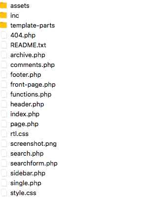

# Introduction to PHP for WordPress

WordPress has a few different types of PHP files. The first type are core files. These usually contain on PHP code and shouldn't be messed with, as they might break your WordPress install. 

The files we will be concentrating on are the theme files. They contain a combination of php and html and are the most common types of files that you'll be editing. Most of the time, where you're just getting started with WordPress development, you'll be working inside the themes folder.

Lets have a look at some of the files we'll be creating and editing inside the themes folders. Navigate to your WordPress files and folders in MAMP/htdocs. 

You'll see 3 main folders, wp-admin, wp-includes, wp-content. wp-content is where we will be working, the other folders form part of WordPress core, and again, we shouldn't be working in those files and folders at all. 

Inside your wp-content folder, you will see another folder that is named 'themes', this is where all your themes will be living, and inside your themes folder is where YOUR custom theme will be created and edited. 

Lets have a look at one of the standard WordPress Themes that  is already in the themes folder, twentyseventeen.  

You can see the two required files, index.php and style.css, as well as many more, such as header.php, functions.php, single.php. 

We'll go into all of these files later in the course when we deal with the WordPress template structure. 

