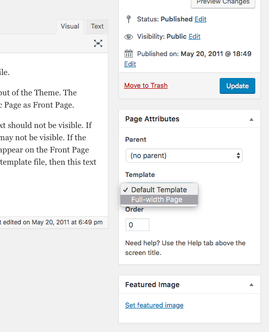

# Page Templates

When you open any pages, you'll immediately see that all of the styling from the single post has carried over. This is because underscores ships with markup that's almost identical on posts and pages. But there are a few differences. 

First of all, pages don't have categories and tags, so they're not displayed. And secondly, themes typically don't display the author name or publishing date because pages are considered static, non-changing content.

In your theme, pages are powered by page.php and content-page.php.

Looking at page.php, you'll see this is pretty much just a duplicate of single.php. The only main difference is inside the loop instead of calling for just content single or just content, you are calling for content dash page. Opening content-page.php, you see this template is also fairly similar to what we started with in content.php before we made all our changes. This template just displays an article, like we did before, with an entry header, with the page title followed by the content and here we're just calling the content with no augmentations because we'll never have a more tag or anything like that.

But what if you want certain pages to look different from the standard pages? In WordPress you can create page templates to do just this, a page template gives you the ability to deviate from your site’s existing structure in addition to adding new features.

Creating a page template is extremely easy. Create any new file in your theme called page-fullwidth.php and start the file with a comment block like so:

```php
<?php
/*
Template Name: Full-width Page
*/
```

Then copy the code from page.php and add it to your template file. Your file should now look like this:

```php
<?php
/*
Template Name: Full-width Page
*/

get_header(); ?>

	<div id="primary" class="content-area">
		<main id="main" class="site-main" role="main">

			<?php
			while ( have_posts() ) : the_post();

				get_template_part( 'template-parts/content', 'page' );

				// If comments are open or we have at least one comment, load up the comment template.
				if ( comments_open() || get_comments_number() ) :
					comments_template();
				endif;

			endwhile; // End of the loop.
			?>

		</main><!-- #main -->
	</div><!-- #primary -->

<?php
get_sidebar();
get_footer();


```

If we now go into our dashboard and edit one of the pages we've created, you should see an option on the right hand side, Under page attributes, to change template.



Change the template to the full width page you've just created and update your page. If you now view your page on the front end you will see it is pulling in exactly the same as your other pages. This is because we need to change the content file. At the moment you're using the content-page.php and we want to create our own so we can style it differently.

Go ahead and create a new file in your template parts folder called content-fullwidth.php. then copy all the code from the content-page.php into this file. 

Great, now we can start updating and styling this to look how we want it to. 

The first thing I want to do is remove the sidebar from this page. In page-fullwidth.php remove the get sidebar hook at the bottom of the page. Then, I also want to remove the comments section, so we'll remove that from our loop. And we need to reference our new content file, so change that to fullwidth.. 

Your page-fullwidth.php should now look like this:

```php
<?php
/*
Template Name: Full-width Page
*/

get_header(); ?>

	<div id="primary" class="content-area">
		<main id="main" class="site-main" role="main">

			<?php
			while ( have_posts() ) : the_post();

				get_template_part( 'template-parts/content', 'fullwidth' );

			endwhile; // End of the loop.
			?>

		</main><!-- #main -->
	</div><!-- #primary -->

<?php
get_footer();


```

When you view on the front end, you will see that your comments are now gone, as well as the widget area. If you want to style this even further, change the div's in your content file and style them accordingly. 

Its really that simple! 

