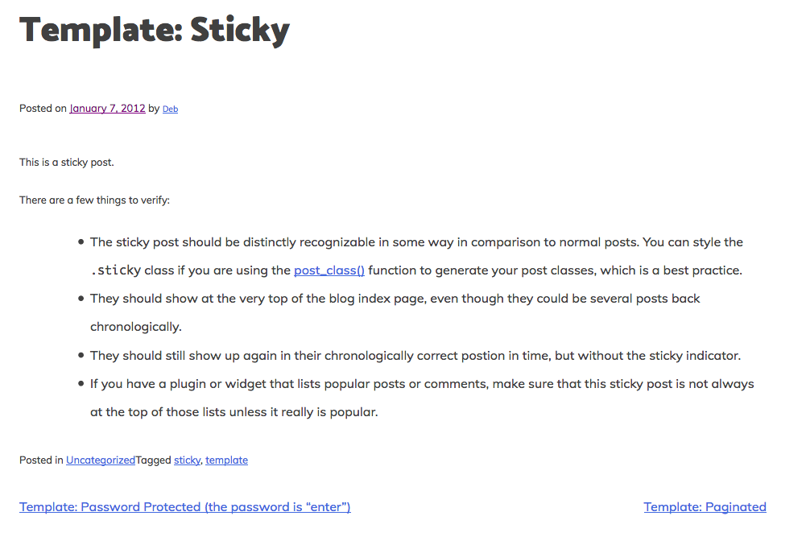
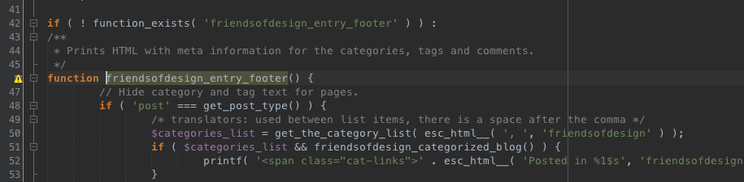
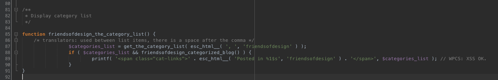
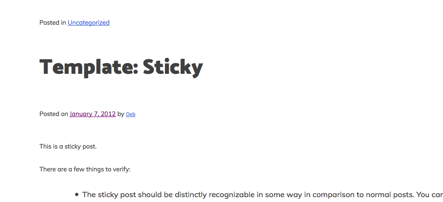
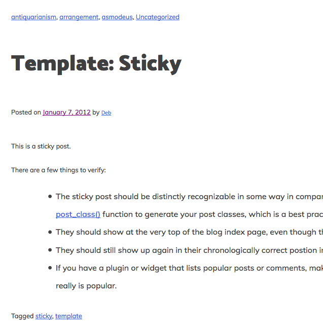
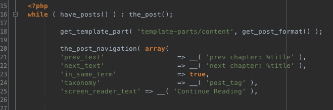

# Single Post Templates

Our header is now complete and we can work on the content views for our theme. We're going to start off with the Single Post Template. 

Lets have a look at what its like now: 



At the top you can see your post title and underneath that is what is called you meta data, then the post content, category links and lastly pagination. 

Meta data will consist of you the date posted and the author. You can expand on the standard meta data, and on the WordPress Codex they give more examples: [https://codex.wordpress.org/Post\_Meta\_Data\_Section](https://codex.wordpress.org/Post_Meta_Data_Section). 

Pagination is usually in the form of 'Next Post' and 'Previous Post', and allows you to page through the blog posts. 

All of this is handled by the single.php file. So lets open this up and have a look. 

```php
<?php
/**
 * The template for displaying all single posts.
 *
 * @link https://developer.wordpress.org/themes/basics/template-hierarchy/#single-post
 *
 * @package friendsofdesign
 */

get_header(); ?>

	<div id="primary" class="content-area">
		<main id="main" class="site-main" role="main">

		<?php
		while ( have_posts() ) : the_post();

			get_template_part( 'template-parts/content', get_post_format() );

			the_post_navigation();

			// If comments are open or we have at least one comment, load up the comment template.
			if ( comments_open() || get_comments_number() ) :
				comments_template();
			endif;

		endwhile; // End of the loop.
		?>

		</main><!-- #main -->
	</div><!-- #primary -->

<?php
get_sidebar();
get_footer();
```

At the top we have the hook 'get-header', this will call in the header.php file. We then have the WordPress loop, which contains a get template part. The we call the sidebar.php and footer.php

As you can see, all the content for single posts are handled by the template part 'content'. If we look inside the template-parts folder, we can see 4 different content files. 

Content none, content page, content search, and content php. Content none is used when there is no content to display, content page is used when we want to display page content, content search returns search results, and content.php is used both for single posts and for index and archive pages.

We're going to be dealing with content.php

```php
<?php
/**
 * Template part for displaying posts.
 *
 * @link https://codex.wordpress.org/Template_Hierarchy
 *
 * @package friendsofdesign
 */

?>

<article id="post-<?php the_ID(); ?>" <?php post_class(); ?>>
	<header class="entry-header">
		<?php
		if ( is_single() ) :
			the_title( '<h1 class="entry-title">', '</h1>' );
		else :
			the_title( '<h2 class="entry-title"><a href="' . esc_url( get_permalink() ) . '" rel="bookmark">', '</a></h2>' );
		endif;

		if ( 'post' === get_post_type() ) : ?>
		<div class="entry-meta">
			<?php friendsofdesign_posted_on(); ?>
		</div><!-- .entry-meta -->
		<?php
		endif; ?>
	</header><!-- .entry-header -->

	<div class="entry-content">
		<?php
			the_content( sprintf(
				/* translators: %s: Name of current post. */
				wp_kses( __( 'Continue reading %s <span class="meta-nav">&rarr;</span>', 'friendsofdesign' ), array( 'span' => array( 'class' => array() ) ) ),
				the_title( '<span class="screen-reader-text">"', '"</span>', false )
			) );

			wp_link_pages( array(
				'before' => '<div class="page-links">' . esc_html__( 'Pages:', 'friendsofdesign' ),
				'after'  => '</div>',
			) );
		?>
	</div><!-- .entry-content -->

	<footer class="entry-footer">
		<?php friendsofdesign_entry_footer(); ?>
	</footer><!-- .entry-footer -->
</article><!-- #post-## -->
```

This template is used both for single posts and for archive pages, and because of this, we have to run a conditional statement that says, if we are on a single post, then wrap the title in an h1 with a class entry title. But, if we're on an archive page or an index page, wrap the title in an h2 with a class entry title, and give it a link that points to the post itself, so people can actually navigate to the post. Then, we have another conditional that tests to make sure this is a post post type, and if it is, we display the entry meta.

Then we end the header, set up a new div with the class entry content, and this will be the actual content of the post. Here, we call the function the content, which just spells out the entire content. If we're on an index page or archive page and the more tag is used, continue reading and then the link will appear next to the content. Then, if the post is paginated, we get some pagination links at the bottom.

The entry content is closed, and then we get a footer with a class entry footer that displays the entry footer content. Entry footer content is currently the words posted in, followed by a list of categories, then tagged, followed by a list of tags, and then, if we're logged in as an author, an edit link. 

The reason why the main content is broken out into a separate file is because we can use the same file for different purposes throughout the site. We're going to make a custom template just for single posts, because there are some structural considerations we have to keep in mind, but this structure here, having content.php used both for single posts and for archive pages is pretty common.

Lets go

First thing we're going to do is move the categories to above the post title. If we open up our content.php file, the first module in the single post template is the header. In the header for my theme, I want to display a list of categories at the very top, above the post title. If we look at template right now, you'll see we have a list of categories, it's down here in the entry footer. So what I need to do is grab the function that is generating that list of categories, break it out, and then call it at the top of the post instead. 

On line 45 we have a function that outputs all the content. If we hold the CMD button on our keyboard and the click that function, it will take you to whatever file that function is in. In this case its taking us to templatestags.php which is a file that sits under the inc folder. Inside templatetags.php, on line 46, we have a function called friendsofdesign entry footer.



This is the function that outputs the entire string of text for the entry footer. All I want here is just the category lists. And at the very top, we have that category list, it says - If post equals get post type, then create a new variable called category list, that gets the category list then escapes it so there are no issues. Puts a comma between each of the categories, and then we run a quick test to see if there are more than one category in the site, and if so, the categories are displayed inside a span of the class cat-links and before the category list, we spell out the words posted in.

That means, to display the categories elsewhere on the site, all I have to do is just grab this code and scroll down a bit to create a new function. Give the function a name, lets call it friendsofdesign-the-category list and just paste the content back in. 



Now we can test to make sure this function actually works by saving templatetags.php, grabbing the name of the new function, going to content.php and just placing in the function where we want the category list to appear. That would be right at the top, directly inside header. So I'll say php friendsofdesign the category list and with the semicolon and the php delimiter. Save that. Back to the front end, and see what happens. Now the category list is right at the top. 



It says posted in, in front of the category lists, so I'm going to take that out. Go back into template tags, and go to my function, then go down here in the printf function, which is what outputs the content.

And here you'll see it says escape html posted in and then the content. So I'm just going to take posted in away. This last part here, the percentage 1$S refers to the first variable over here in the list and that first variable is categories list which is the variable we defined just above. So, save again. Go back, and now you see we only have one category at the top. Just to make sure that this works, even if we have multiple categories, I should go in and edit the post and just add a couple additional categories here.

So, save again. Go back, and now you see we only have one category at the top. Just to make sure that this works, even if we have multiple categories, I should go in and edit the post and just add a couple additional categories here.

So I'll just pick some random ones. Update the post. View the post. And now we have a full list of categories, separated by commas. 

Now that we have the category list at the top, we should remove it from the footer. So the final step is to go back to content.php, scroll down and find the original function again humescores entry footer. Again, CTRL or command click, to get to the function and here, I'll simply remove the code for displaying the category list entirely, because we've broken it out into a separate function.

And then change the comment at the top here. Hide tag text for pages. What we're left with is the category list at the top and provisionally, a tag list at the bottom. So again, if I go into the post and add some tags, click add, update and view post. We have categories at the top and tags on the bottom.



### Styling the single post

We're going to jump into styling the single post page, and as we have been doing, this is all done through sass. This time we're going to go into sass &gt; site &gt; primary &gt;posts and pages.scss

So if we check in our inspector tools, we can see that we want to target the entry header has a whole because thats what wraps around the entire header. So we'll use the class entry-header.

Then if we want to change the category links we need to add the class cat-links to the sass file.

Take a moment to style these as you want to, I've styled them as follows:

```css
.sticky {
	display: block;
}

.hentry {
	margin: 0 0 1.5em;
}

.entry-header {
    font-family: $font-heading;
}

.cat-links {
    font-size: 90%;
    font-family: $font__navigation;
    font-style: italic;
    
    a {
        text-decoration: none;
        color: #404040;
        
        &:focus,
            &:hover {
            background-color: aliceblue;
            color: #404040;
        }
    }
}

.entry-meta{
    font-size: 90%;
    font-family: $font__navigation;
    font-style: italic;
    
    a {
        text-decoration: none;
        color: #404040;
        
        &:focus,
            &:hover {
            background-color: aliceblue;
            color: #404040;
        }
    }
}
```

You can style and move things around however you want to, using the methods above. 

The last thing we're going to do is edit the post navigation \(pagination\). The post navigation can be found in our single.php

There are various different parameters that we can add to our post navigation, and they're quite versatile. If we have a look on the WordPress Codex page, you can see an example of this, [https://developer.wordpress.org/reference/functions/the\_post\_navigation/](https://developer.wordpress.org/reference/functions/the_post_navigation/)

```php
the_post_navigation( array(
            'prev_text'                  => __( 'prev chapter: %title' ),
            'next_text'                  => __( 'next chapter: %title' ),
            'in_same_term'               => true,
            'taxonomy'                   => __( 'post_tag' ),
            'screen_reader_text' => __( 'Continue Reading' ),
        ) );
```

Lets go ahead and add this example as such: 



If we now look on our single post, you can see that the navigation has changed. It now says prev chapter followed by the post title. So we know that this works, but I don't want it to say that. I want it to say Previous Post and Next Post. All we need to do is change the text in the parameters. The %title will always pull in the post title, so we're going to leave that there. 

Lets get into styling again. If you look on the front end and open your inspector tool, you can see that the styles for the navigation are located in the sass &gt; navigation &gt; menus.scss. At the moment there are a few styles in there, but we don't need them and we're going add our own, so delete those styles and using your inspector tool to identify the classes and id, change the styles to your own theme. I did the following:

```css
.nav-links{
    a {
        color: #404040;
        background-color: aliceblue;
        text-decoration: none;
        
        &:focus,
            &:hover {
            background-color: #fff;
            color: #404040;
        }
    }
}
```


