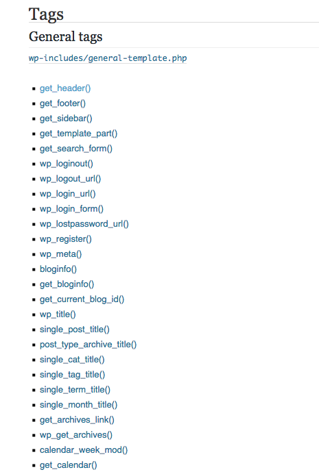

# Template Tags

WordPress comes with a lot of premade functions that easily let you get access to commonly used pieces of information that you may want to use on your site. These premade functions are called template tags and they are one of the first things you begin to use when working with PHP and WordPress.

Some template tags only generate a single bit of data, such as a link to a blog post. Other template tags can output a number of different pieces of data, and therefore require you to specify what you're looking for. We specify what we're looking for by using something called parameters.

This will all make more sense when we look at examples of template tags in action. Before we do that though, let's go over to the [WordPress Codex](https://codex.wordpress.org/Template_Tags) and look at a full listing of all the different template tags we have available to us when we're coding WordPress sites.




The Codex is a massive reference that you should go through. If we scroll through, we can see a list of all of the major template tags that are available in WordPress. From the comment get header and get footer, all the way down to blog info, as well as tons of other tags grouped so that they make sense for basically what they're about.

If you're not sure about what one of these is, you can click through and see examples on how to use it, any parameters that are needed, as well as what is outputted.

It's worth taking the time to scroll through just to see what's available in WordPress and to get yourself familiar with what you might see when you begin to look through and code out some of the template files that are available.

Let's go into a few files inside one of the default WordPress themes, 2015 \(twentyfifteen\). Again, this is inside of our wp-content themes folder and then inside the twentyfifteen folder.

We'll start with looking at the header.php file.

Template tags are going to be inside of a php block, separated by an underscore, and then have parentheses at the end of them.

We could see here, bloginfo, accepting two different parameters, and giving out two different pieces of information here.

```php
		<h1 class="site-title"><a href="<?php echo esc_url( home_url( '/' ) ); ?>" rel="home"><?php bloginfo( 'name' ); ?></a></h1>
					<?php else : ?>
						<p class="site-title"><a href="<?php echo esc_url( home_url( '/' ) ); ?>" rel="home"><?php bloginfo( 'name' ); ?></a></p>
					<?php endif;

					$description = get_bloginfo( 'description', 'display' );
					if ( $description || is_customize_preview() ) : ?>
						<p class="site-description"><?php echo $description; ?></p>
					<?php endif;
				?>
```

We can come down and see esc\_url. This right here is commonly used in WordPress and although it's not a template tag, you will see it often used instead of the echo statement because it allows WordPress to echo out things and have different files that display different messages if different languages are installed or running on the site.

Close the header.php file and go into the page.php. 

You can see that this file is fairly empty, although it does have an important thing here, get\_template\_part. 

```php
<?php
		// Start the loop.
		while ( have_posts() ) : the_post();

			// Include the page content template.
			get_template_part( 'content', 'page' );

			// If comments are open or we have at least one comment, load up the comment template.
			if ( comments_open() || get_comments_number() ) :
				comments_template();
			endif;

		// End the loop.
		endwhile;
		?>
```

What this is doing, is including another file called content page.php. If we were to then to go into content.page.php, we could see we have more template tags, like the ID, post class, the content, the title, edit\_post\_link.

```php
<header class="entry-header">
		<?php the_title( '<h1 class="entry-title">', '</h1>' ); ?>
	</header><!-- .entry-header -->

	<div class="entry-content">
		<?php the_content(); ?>
		<?php
			wp_link_pages( array(
				'before'      => '<div class="page-links"><span class="page-links-title">' . __( 'Pages:', 'twentyfifteen' ) . '</span>',
				'after'       => '</div>',
				'link_before' => '<span>',
				'link_after'  => '</span>',
				'pagelink'    => '<span class="screen-reader-text">' . __( 'Page', 'twentyfifteen' ) . ' </span>%',
				'separator'   => '<span class="screen-reader-text">, </span>',
			) );
		?>
	</div><!-- .entry-content -->

	<?php edit_post_link( __( 'Edit', 'twentyfifteen' ), '<footer class="entry-footer"><span class="edit-link">', '</span></footer><!-- .entry-footer -->' ); ?>

```

When you're coding WordPress sites, template tags are going to be a massive reference to allow you to easily and quickly get the information out of WordPress that you need and display it in your theme.

Take some time to look over this template tags page to familiarise yourself with what is possible.

