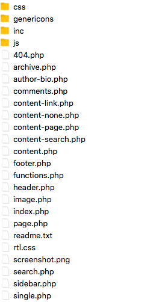

# The Loop

WordPress uses something called the loop, which is a combination of conditional statements and a while loop. You can't become a WordPress developer without getting familiar with the loop and chances are, a lot of the code you'll want to edit early on in your WordPress development will take place inside of the loop. 

For the 2015 theme, the template index.php is the one that controls the main home page here. By default, this will display several blog posts. And what we're going to do is open up this file and take a look at the loop that is controlling how this works. If we come in, we can see that our conditional statement starts with an if and then have\_posts.

```php
		<?php if ( have_posts() ) : ?>

			<?php if ( is_home() && ! is_front_page() ) : ?>
				<header>
					<h1 class="page-title screen-reader-text"><?php single_post_title(); ?></h1>
				</header>
			<?php endif; ?>

			<?php
			// Start the loop.
			while ( have_posts() ) : the_post();

				/*
				 * Include the Post-Format-specific template for the content.
				 * If you want to override this in a child theme, then include a file
				 * called content-___.php (where ___ is the Post Format name) and that will be used instead.
				 */
				get_template_part( 'content', get_post_format() );

			// End the loop.
			endwhile;

			// Previous/next page navigation.
			the_posts_pagination( array(
				'prev_text'          => __( 'Previous page', 'twentyfifteen' ),
				'next_text'          => __( 'Next page', 'twentyfifteen' ),
				'before_page_number' => '<span class="meta-nav screen-reader-text">' . __( 'Page', 'twentyfifteen' ) . ' </span>',
			) );

		// If no content, include the "No posts found" template.
		else :
			get_template_part( 'content', 'none' );

		endif;
		?>
```


 The colon here allows us to close this php block, and then later open it up. Way down here and type in an endif. 

So we have the opening of our conditional statement, if have\_posts here, and then way down here, we have the closing, endif. 

In between we can see that we also have the else statement. So this is reading, if we have posts, do all of this. Otherwise, if you don't have posts then do this. 

This get\_template\_part finds a file called \('content', 'none'\) and then echos out that template or runs that template here. So if we come inside of our if statement and we do have posts, we could see another conditional statement is running here that's if it's the home or front page, then output this. Otherwise, we can see Start the loop. And while we have posts, do the following.

 So the first conditional statement is simply checking to see if there are posts. The while statement is going to continue to run as long as we have posts that are displaying. However we can see there's not much code inside of here, inside of this while statement that opens here and closes here. The reason for this is because WordPress has taken the code that goes here, and put it inside of a different template file that's going to be named 'content' followed by the post format. If we come in to our template file structure, we could see that we have content link. 



Content-none, content-page, content-search, and then just regular content. So these are the different types of files that will be included depending on whether or not there's a specific post format or whether there's no content at all.

However, what I want to demonstrate is this while statement. We could see on our site that I've added three blog posts. However, if we come into our Dashboard and under Settings, Reading, we change the blog posts to show at most to 1, and we come here again, we can see that we're only seeing one, and then it's gonna divide them up onto different pages. Likewise, if I come back in and set this to 10, but I come into my posts, and I put two of them into the trash, when I view my site it's only going to display one. This is demonstrating how this while loop works.

 If I were to come in and delete my final post, we can see that nothing is found. What's happening here, is that my if statement of if I have posts if failing, and it's going to run the else statement instead. Which will include get\_template\_part, \('content', 'none'\). If we open up the content-none file, we can see that it displays out 'Nothing Found'. 

Now in your own theme you may not include template parts right here and you may put the actual code for your loop, however it is a common Word Press convention to make template parts instead of including all the code inside of the main loop. 

So if you find yourself making child themes or trying to begin to customize other existing themes, you may find that it has the contents of a loop outside of the loop and in these separate files. However, there are some themes and some theme developers that put all the code inside of the main loop itself. 

Let's take a look at WP query and find out how write custom loops.

