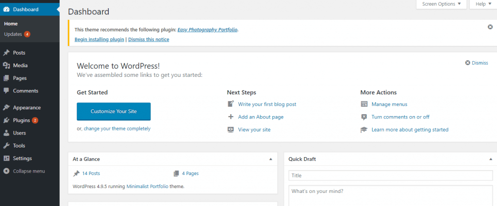

# WordPress Dashboard

When you log in to WordPress the dashboard is the first thing that you will see. The Welcome to WordPress! page will tell you all the activity that is happening in your WordPress site. 

The first thing we need to do is to go through the Screen Options, which is located on the top right of your screen. You can then select what you want to see by checking the boxes in the drop-down menu.

#### Posts

Here you’ll see all the posts published on the blog. In order to create a new post click “Add new” from the drop-down menu or at the top of the page right next to the “Posts” headline.

The WordPress editor \(WYSIWYG\) is where you can create blog post content, write texts and/or add images.  You can choose the type of text, make it bold or italic, create bulleted or numbered lists, align the text, or insert the link.

#### Media

The Media tab allows you to manage your media library and image files that you uploaded to the library. Here you can choose to filter images using the drop-down menu. To add an image to the library, click Add New next to the “Media Library” headline, or you can easily drag and drop into the media library page. 

#### Pages

Pages are the pages of a website with permanent content in them. By adding a new page you basically add a part of the website. In order to view these pages on your website, you will need to add each page to your Menu. 

#### Appearance

Here you can choose a theme, edit the chosen theme, add widgets \(additional functionality to your website\), create and edit **menus**. You can also customize your website’s theme by clicking a “Customize” option.

WordPress **Customizer** allows you to edit the appearance of your theme without knowing any code and you can see the changes in real time.

**Widgets** are small parts of a website that add functionality to a sidebar bar \( or widgetized area \). For example, you can add a calendar to your site or a search bar. 

**Menus** allow users to navigate and choose the part of the website they’re most interested in. From the Menus editor, you can rearrange menu items, create new menus, and add pages or links to the existing menu.

#### Plugins

Plugins are mini tools that add functionality to your site. Unlike widgets, plugins add functionality that can’t be seen on the surface. They, however, make managing a WordPress site a lot easier.

You can add plugins by clicking the Add New button next to “Add Plugins” at the top. Before you can use the plugin, you need to install and activate it. You can also deactivate a plugin if it’s no longer used.

#### Users

This is where you can create additional users for your site. This option is useful if you have other blog authors and contributors. You can give each user an unlimited range of rights, or restrict access if needed.

#### Tools

If you’re migrating your website, this is where you can import or export your content.

#### General

Settings area allows you to tweak some of the admin options.

**General** – contains settings such as a site address, time zones, language, and date format.

**Writing** – set up default post category and default post format. 

**Reading** – set up how many blog pages should be displayed and determine whether your homepage should display latest posts or a static page.

**Discussion** – choose whether you want to all your comments to be approved automatically. You can also disable or enable comments section.

**Media** – configure default image sizes.

**Permalinks** – this section defines how your URL links are displayed.

