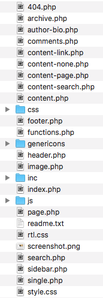

# WordPress template structure

Not all of the files are mandatory for a WordPress theme. We are  going to discuss the main files in the theme structure.


### 



### The stylesheet

The WordPress theme folder will contain a style.css file in the theme folder. This file will  have all the style information for your website.

The style.css will also have one very important thing which is the theme header. The theme header will show as comments in the style.css and will describe the theme. 

```php
/*
Theme Name: Twenty Fifteen
Theme URI: https://wordpress.org/themes/twentyfifteen/
Author: the WordPress team
Author URI: https://wordpress.org/
Description: Our 2015 default theme is clean, blog-focused, and designed for clarity. Twenty Fifteen's simple, straightforward typography is readable on a wide variety of screen sizes, and suitable for multiple languages. We designed it using a mobile-first approach, meaning your content takes center-stage, regardless of whether your visitors arrive by smartphone, tablet, laptop, or desktop computer.
Version: 1.9
License: GNU General Public License v2 or later
License URI: http://www.gnu.org/licenses/gpl-2.0.html
Tags: blog, two-columns, left-sidebar, accessibility-ready, custom-background, custom-colors, custom-header, custom-logo, custom-menu, editor-style, featured-images, microformats, post-formats, rtl-language-support, sticky-post, threaded-comments, translation-ready
Text Domain: twentyfifteen

This theme, like WordPress, is licensed under the GPL.
Use it to make something cool, have fun, and share what you've learned with others.
*/
```

This contains metadata for the theme, such as the theme name which will be shown in the WordPress admin for selection. It also contains other tags such as the Theme URI,  author name, description etc. This header is necessary for WordPress system to recognize your theme.

If you go through more in the style.css you will see that it contains the style information for various tags used in the theme.

#### Home Page display [\#Home Page display](https://developer.wordpress.org/themes/basics/template-hierarchy/#home-page-display) {#home-page-display}

By default, WordPress sets your site’s home page to display your latest blog posts. This page is called the blog posts index. You can also set your blog posts to display on a separate static page. The template file `home.php` is used to render the blog posts index, whether it is being used as the front page or on separate static page. If `home.php` does not exist, WordPress will use `index.php`.

1. `home.php`
2. `index.php`

#### Front Page display [\#Front Page display](https://developer.wordpress.org/themes/basics/template-hierarchy/#front-page-display) {#front-page-display}

The `front-page.php` template file is used to render your site’s front page, whether the front page displays the blog posts index \(mentioned above\) or a static page. The front page template takes precedence over the blog posts index \(`home.php`\) template. If the `front-page.php` file does not exist, WordPress will either use the `home.php` or `page.php` files depending on the setup in Settings → Reading. If neither of those files exist, it will use the `index.php` file.

1. `front-page.php` – Used for both “**your latest posts**” or “**a static page**” as set in the **front page displays** section of Settings → Reading.
2. `home.php` – If WordPress cannot find `front-page.php` and “**your latest posts**” is set in the **front page displays** section, it will look for `home.php`. Additionally, WordPress will look for this file when the **posts page** is set in the **front page displays** section.
3. `page.php` – When “**front page**” is set in the **front page displays** section.
4. `index.php` – When “**your latest posts**” is set in the **front page displays** section but `home.php` does not exist _or_ when **front page** is set but `page.php` does not exist.

As you can see, there are a lot of rules to what path WordPress takes. Using the chart above is the best way to determine what WordPress will display.

#### Single Post [\#Single Post](https://developer.wordpress.org/themes/basics/template-hierarchy/#single-post) {#single-post}

The single post template file is used to render a single post. WordPress uses the following path:

1. `single-{post-type}-{slug}.php` – \(Since 4.4\) First, WordPress looks for a template for the specific post. For example, if [post type](https://developer.wordpress.org/themes/basics/post-types/) is `product` and the post slug is `dmc-12`, WordPress would look for `single-product-dmc-12.php`.
2. `single-{post-type}.php` – If the post type is `product`, WordPress would look for `single-product.php`.
3. `single.php` – WordPress then falls back to `single.php`.
4. `singular.php` – Then it falls back to `singular.php`.
5. `index.php` – Finally, as mentioned above, WordPress ultimately falls back to `index.php`.


#### Single Page [\#Single Page](https://developer.wordpress.org/themes/basics/template-hierarchy/#single-page) {#single-page}

The template file used to render a static page \(`page` post-type\). Note that unlike other post-types, `page` is special to WordPress and uses the following path:

1. `custom template file` – The [page template](https://developer.wordpress.org/themes/template-files-section/page-template-files/) assigned to the page. See [`get_page_templates()`](https://developer.wordpress.org/reference/functions/get_page_templates/).
2. `page-{slug}.php` – If the page slug is `recent-news`, WordPress will look to use `page-recent-news.php`.
3. `page-{id}.php` – If the page ID is 6, WordPress will look to use `page-6.php`.
4. `page.php`
5. `singular.php`
6. `index.php`


#### Category [\#Category](https://developer.wordpress.org/themes/basics/template-hierarchy/#category) {#category}

Rendering category archive index pages uses the following path in WordPress:

1. `category-{slug}.php` – If the category’s slug is `news`, WordPress will look for `category-news.php`.
2. `category-{id}.php` – If the category’s ID is `6`, WordPress will look for `category-6.php`.
3. `category.php`
4. `archive.php`
5. `index.php`

