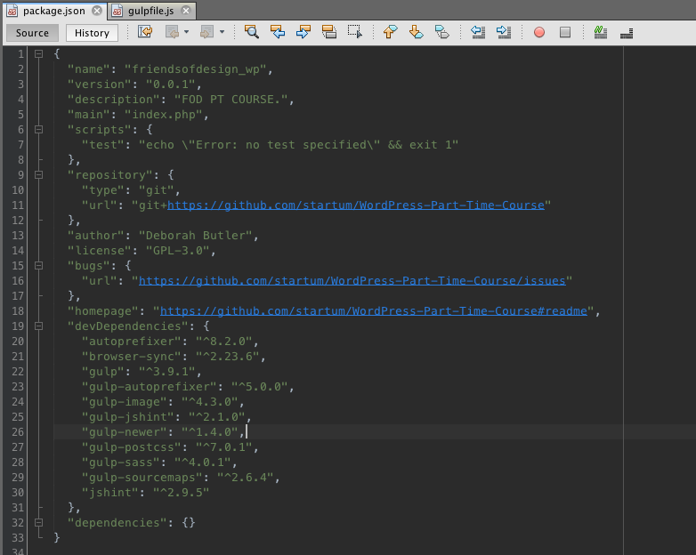

# Working with Sass, gulp and npm

We're no going to get into development work flow that uses a series of command line tools to do things like compile CSS from SASS files, compress and optimize images, and make it easier to update your browser with your latest code and even access the current development site using other devices on the network, such as smartphones. All of this is managed using the Gulp task runner and a script. I built a script so you can use it for this theme in the course and then modify it to work with any other theme you build in the future.

In order for this to work, you need to have Gulp, Node and NPM installed on your computer. We've already run this for you. If you want to check out how to do this yourself, there are a number of resources online which will take you through this process step-by-step.

If you look in your folders, you will see a folder called gulp-dev. Open up your htdocs folder, go to wp content, themes, and then copy gulp dev folder into the themes folder.

The gulp dev folder needs to sit next to all the other folders that contain themes, that's how we make it independent of the current theme you're working on. We need to configure the Gulp process to work with your project and we do that from the code editor \(NetBeans\). 

So lets go to the wp content, themes, and gulp dev folder, and first I'll open package.json. This is the configuration file NPM uses to understand what this project is all about. At the top you'll see we have the name of the project, friendsofdesign\_wp, \(you change it to whatever the name of your project is for future use\).

You can set a version number, provide a description, main points at the main file for the project, which will be your index.php. If you're using Git, you will need to set up the repository you're using, if you are using a separate repository, either on GitHub or Bitbucket or somewhere else, so this would point at your repository, not mine. You can see right now it's pointing at the repository for this course. Further down you have author, which is where you'll put your own name.

Once you've made changes scroll down and take a look at the devDependencies. Now right now the Gulp process uses all of these different tools to do different things.

This is a list of all the dependencies that need to be installed in your project for everything to work. So once you're done with this setup and package JSON has been saved we're going to run the installer and install all of these things at once. To do that you need to open your command line tool, which is Terminal for mac. If we hit the search icon at the top right hand corner of your screen, and type in Terminal and enter, it will open up your command line tool. We'll refer to this as the terminal from now on. 

From here navigate to the folder that contains your Gulp project. In order to change directory \(folder\), you will need to use the command 'cd'. To get to your gulp-dev folder, we need to type in the following: cd /Applications/MAMP/htdocs/wp-content/themes/gulp-dev. 

Once we're inside the gulp-dev folder, we will have to run an NPM installer to install all the dependencies that are specified in package.json. All we need to do for this is in the terminal, type in npm install and the installer will start its work.

The process takes a while to install the dependencies, and once its done you will see a new folder that contains all the modules we installed. We don't need to go through those, but we are going to look into the Gulpfile.js

This is the actual folder that is going to manage the project we're working on. This is where you'll make changes if you move into another project.

Gulp dev lives outside of any of the themes, and that means you can hook it to any theme you want when you want to work with it. The way you do that is by opening Gulpfile.js and pointing the first variable, themename, to the name of the folder that contains the theme you want it to be applied to.In this case, the theme name is friendsofdesign\_wp.

I've set up a number of different tools which are essential for working with underscores. You don't need to set any of these up, but we'll just have a look at what each one does.

CSS via Sass and Autoprefixer

This grabs any of the scss and Sass files inside the scss folder, generates sourcemaps for them, then runs the sass compilation process.

We run postcss's autoprefixer on it afterwards to autoprefix any content that needs to be workable on older browsers. Then write a sourcemap into our project and then place a CSS file in the root of the project, so we get a CSS file that works with the WordPress site. 

Optimize images through gulp-image - this is an image optimization tool that goes to the images folder, looks for the folder called RAW and any images within that folder, checks to see if those files are new or if they are the same that were there before, then runs an image optimizer on them and places the images back in the images folder.

JavaScript - This one grabs the javascript folder and looks for any js file within the javascript folder, then runs the jshint on it to make sure there are no errors, tells you if there are errors, and then places the JavaScript files back in the javascript folder. Later on if you want to maybe compress JavaScript files or something like that you would hook that functionality into this JavaScript task.

Watch everything - This is the task that sits and watches our entire WordPress theme project for any changes in the CSS files, in which case we run the css task, JavaScript files to run the javascript task, image files, in which case we run the images, and finally, changes to any file, which triggers browserSync. Now browserSync is a really useful tool, it literally syncs the browser to your current development environment and also allows you to access that development environment from a browser that's on a different device on the local network.

To get browserSync to work properly we would do one configuration setting, however that has been setup for you \(proxy: 'localhost:8888'\). 

Default task \(runs at initiation: gulp --verbose\) - This is a default task that runs watch. And watch triggers browserSync and then watches for any of the files. The only thing you would need to change if you want to change to a different project is at the very top set the name of the theme folder and at the very bottom change this proxy URL to the URL of the current live version of the site you're working on. 

So to the get this working, we'll go to our terminal again, all the dependencies should now have been installed, and we'll run the command 'gulp'

